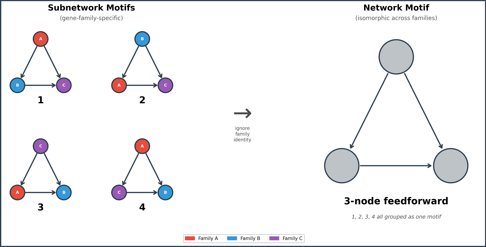
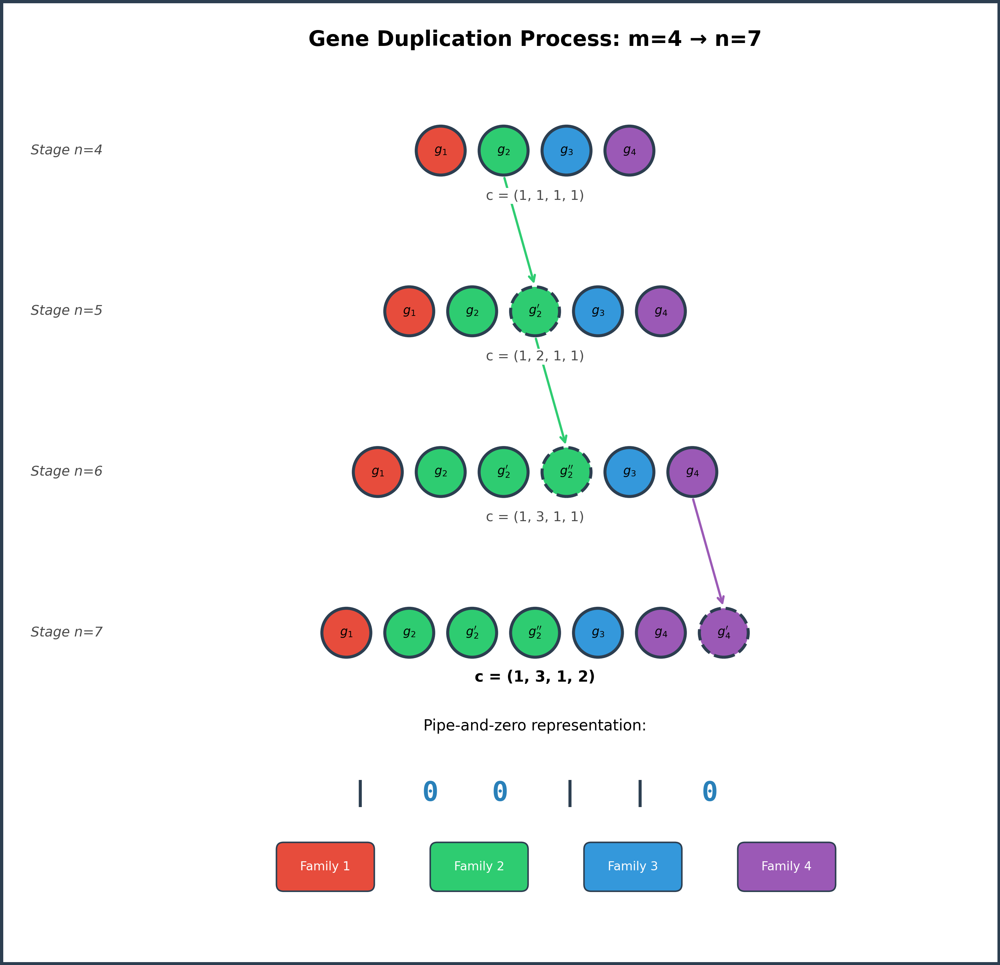

# Subnetwork Motifs

A mathematical and computational framework for analyzing recurring subgraph patterns in complex networks that preserve node-class identity.

## Overview

Subnetwork motifs are gene-family-specific substructures found in genetic regulatory networks (GRNs). Unlike traditional network motifs, which identify isomorphic subgraphs, subnetwork motifs distinguish patterns based on the specific node classes (e.g., gene families) involved. This distinction allows researchers to determine which gene families and regulatory relationships are statistically significant under models of network evolution.


*Subnetwork motifs preserve gene-family identity (colored nodes), while traditional network motifs group all isomorphic subgraphs together. By retaining family-level information, subnetwork motifs allow researchers to test whether specific regulatory relationships between specific gene families are statistically significant, rather than treating all structurally similar patterns as interchangeable.*

This framework provides:

- Exact closed-form expressions for expected count and variance of subnetwork motifs under a gene duplication null model
- Statistical significance testing of regulatory architectures
- Organism-agnostic methodology with demonstrated cross-domain applicability

### Gene Duplication Model


*A network grows from 4 initial genes to 7 through successive duplication steps. Each gene belongs to a family (color), and duplicated genes inherit the regulatory relationships of their parent gene with probability π.*

The framework explores two duplication models:

- **Full Duplication** (π = 1 for all families): Every regulatory link is inherited at each duplication step. This serves as a baseline where the network topology grows deterministically.
- **Partial Duplication** (0 ≤ π ≤ 1, varying by family): Each gene family has its own probability of retaining regulatory links through duplication, reflecting the biological reality that some regulatory relationships are more conserved than others.

Closed-form expressions for the expected count and variance of subnetwork motifs are derived under both models, enabling statistical significance testing to identify which gene-family-specific regulatory patterns are over- or under-represented in a GRN.

## Publication

**Counting Subnetworks Under Gene Duplication in Genetic Regulatory Networks**
Ashley Scruse, Jonathan Arnold, and Robert Robinson
*Bulletin of Mathematical Biology*, 2025

- [Published article (open access)](https://link.springer.com/article/10.1007/s11538-025-01592-1)


## Project Structure

```
subnetwork-motifs/
├── README.md
├── docs/           # Documentation and background
├── src/            # Source code
├── data/           # Network datasets
├── notebooks/      # Analysis notebooks
└── results/        # Output and figures
```

## Getting Started

Coming soon. This repo is under active development.

## License

TBD

## Contact

Ashley Scruse, Ph.D.
Deputy Director, Morehouse Supercomputing Facility
AUC DSI Faculty Fellow
